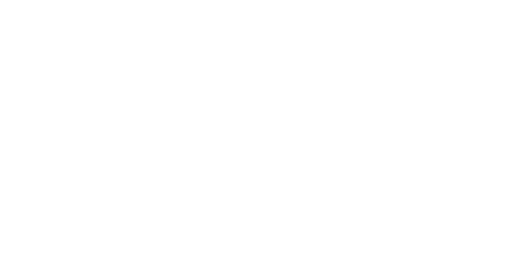
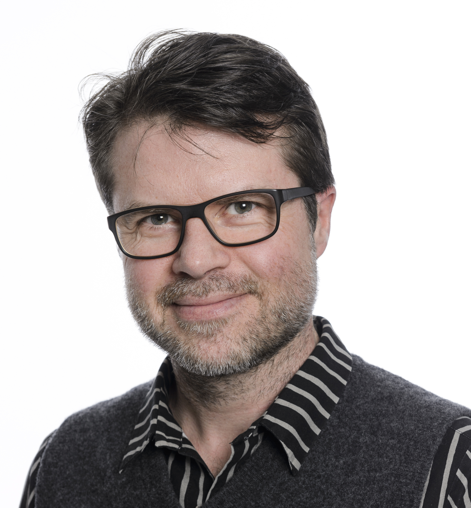
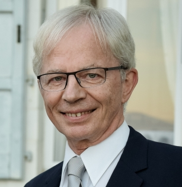
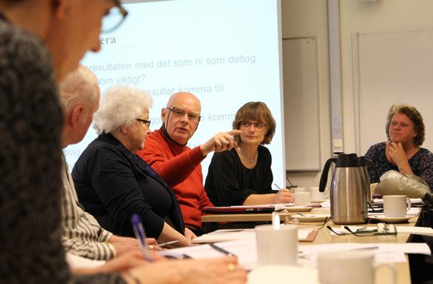
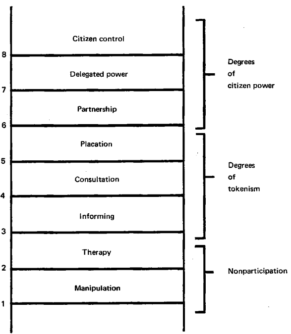
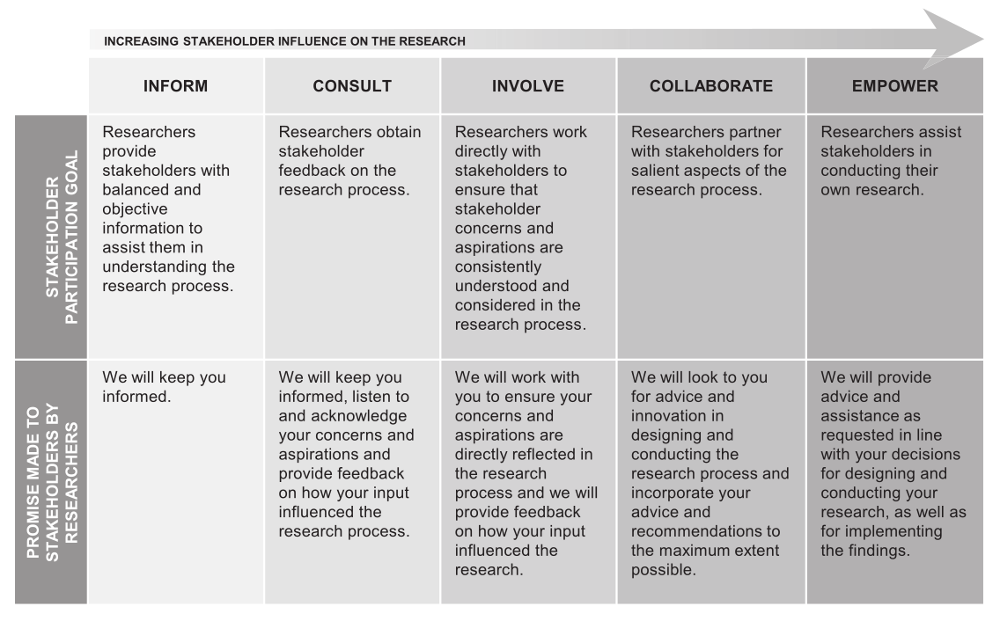

class: inverse, left, middle, title-slide

# Half-time review
## for my doctoral studies 
### Joakim Frögren
### Department of Health Sciences, Lund University
### 2020-08-27

---

# Supervisors
<!-- Här skulle jag kunna lägga in bilder på dem -->

![:col_header Main supervisor, Co-supervisor, Co-supervisor]
![:col_row ,
, ]
![:col_row 
Professor <b>Susanne Iwarsson</b>1 
, 
Assoc. Researcher <b>Oskar Jonsson</b>1
, 
Hon. Prof. <b>Roderick Lawrence</b>2
]

[1] Department of Health Sciences, Lund University

[2] University of Geneva, Geneva School of Social Sciences (G3S); Institute for Environmental Sciences (ISE) Geneva, Switzerland

???

<!--

# Reviewers
<!-- Här skulle jag kunna lägga in bilder på dem
* Assistant Professor __Lena Rosenberg__1

* Professor __Ewa Wikström__2

.footnote[
[1] Dept of Neurobiology, Care Sciences and Society, Occupational Therapy, Karolinska Institute

[2] Dept of Business Administration, School of Business, Economics and Law, Gothenburg University
]

???

-->
---

My PhD project:
# Involving citizens and professionals in research on ageing and health

**Overarching aim**:
* The overarching aim is to increase the understanding of the involvement of
professionals and citizens in research on ageing and health; 

  + how such efforts are perceived;
  + how professional know-how and citizens’ ways of knowing could contribute to the knowledge development in research on ageing and health. 

* An additional overarching ambition is to gain insights of the potential and pitfalls of various participatory approaches and thereby contribute to the methodological development in the field.

---

class: inverse, center, middle, navy-slide

# What does to *involve* someone in research mean? 

---

# To *involve* someone in research means...

--

.pull-left[

### that the participant is actively part of the process, not just a study object

]

--

.pull-right[
### However, not either or but  rather a <a class="grey-fade"> grey scale </a>

]

???

* The there is an outspoken aim that the person engaged in research should be  actively part of (and thus able to influence) the process  of conducting research,  not just a passive object being studied by the researcher(s).

* Rather than either or it is a grey scale where it is difficult to draw the exact boundary of where someone is actively participating in a research process.

---

# Arnstein's *Ladder of participation*1 influential

[1] Fig. from Arnstein, S. R. (1969). A ladder of citizen participation. <i>Journal of the American Institute of Planners</i>, 35(4), p. 217-224. <a href=http://doi.org/10.1080/01944366908977225>doi.org/10.1080/01944366908977225</a>

???

address public participation in
government decision making.

---

# Bammer's spectrum1 one recent example

[1] Fig. from Bammer, G. (2019). Key issues in co-creation with stakeholders when research problems are complex. <i>Evidence & Policy</i>, 15(3), p. 423–435.
  <a href=http://doi.org/10.1332/174426419X15532579188099>doi.org/10.1332/174426419X15532579188099</a>

---

class: inverse, center, middle, navy-slide

# Why involve citizens and professionals in research?

---

# Involving citizens and professionals in research has to do with...

### I. Public Administration1/ Democracy

--
To whom do we leave to...
* describe the needs of older people?
* decide on priorities in research and societal development?

.pull-left[

]
.pull-right[
]

[1] Hronszky, I. (2005). <i>Parallelities in participatory approaches in production and public administration</i>. In H. Rohracher (Eds.), User Involvement in Innovation Processes (pp. 371–404). Profil.

---

# Involving citizens and professionals in research has to do with...

### II. Production/ Innovation

--

#### Universities:
* produce knowledge and innovations linked to 'real-world problems'

--

#### Citizens and professionals:
* facing 'real-world problems'
* recruited as (potential) 'users' to provide feedback or co-create  the knowledge/ innovations being produced 

--

#### Complex 'real-world problems': 
* typically ill-defined
* 'wicked' in nature
* require a plethora of perspectives, and thus collaborative efforts

---

class: inverse, center, middle, navy-slide

# So... what is the knowledge gap?

---

# More knowledge needed related to...

#### The power balance between researcher(s) and the participants
* Risks of reproducing existing inequalities rather than addressing them (Buffel, 2015)
* Potential for unjust exercises of power (Hickey & Mohan, 2004) 

--

#### The methods/methodologies to use in order to... 
  + convert expressed concerns and ideas into proper research questions (Erdtman et al., 2012).
  + appropriately recruit representatives (Gradinger et al., 2015)
  + adequately involve users in data collection (Priestley et al., 2010) and in the analysis of
the findings (Cotterell, 2008). 

--

####  And overall there is... 
* a scarcity of studies about involving various user groups, including citizens and professionals, in ageing and health research
(Kylberg et al., 2018).

---

class: inverse, center, middle, navy-slide

# Study I

---

**Study I** explored the wicked problem of providing accessible housing for the ageing population in Sweden, with a specific focus on the identification of critical aspects in decision-making, using the Research Circle methodology and deductively applying a framework from transdisciplinary science.

---

class: inverse, center, middle, navy-slide

# Study II

---

Study II investigates the awareness of and attitudes towards public involvement in research on ageing and health among 60+ citizens in Sweden, through a survey analysed descriptively and through multivariable regression analysis.

---

class: inverse, center, middle, navy-slide

# Study III

---

Study III inquires how senior citizens in Sweden experience being involved in a mass experiment targeting housing accessibility, applying a mixed method approach.

---

class: inverse, center, middle, navy-slide

# Study IV

---

Study IV elucidates potentials and pitfalls related to the establishment and maintenance of mechanisms for involving professionals and citizens in the context of a research centre for ageing research, through an abductive qualitative analysis of documents and interviews.

---

# Thank you!

Logos here

---

